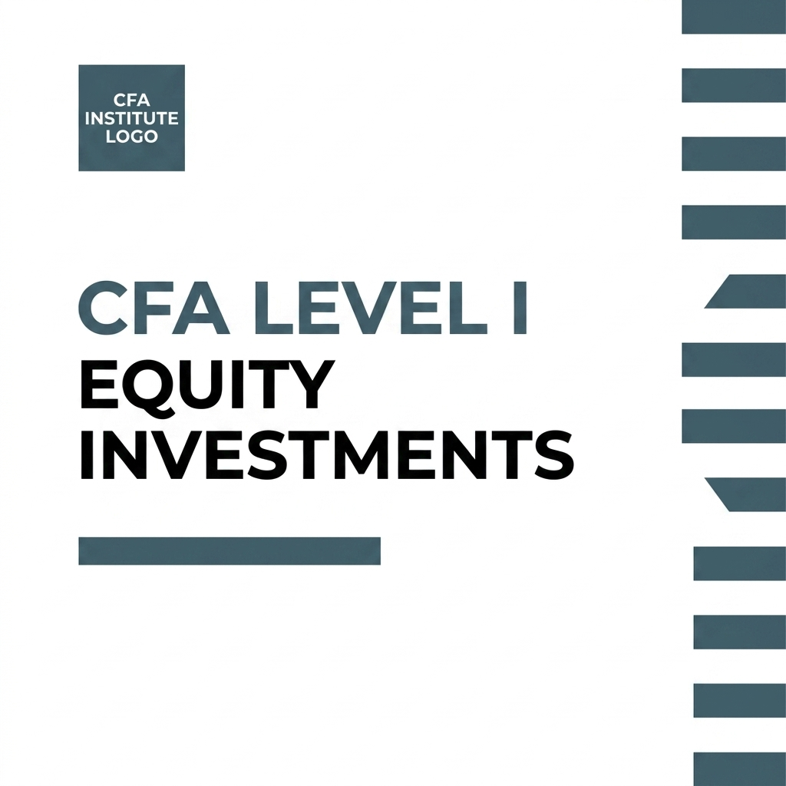

# CFA Level I: Equity Investments — Audio Companion & Landing Page

A premium, interactive web landing page and audio learning companion for the CFA Level I Volume 5: Equity Investments curriculum.

This web application provides a storytelling walkthrough of all 8 learning modules with an integrated custom audio player, volume manager, playback speed (velocity) regulator, and visual charts/tables extracted from the official CFA curriculum.



## Folder Structure

```
Luca's Book/
├── index.html        # Main landing page HTML structure
├── styles.css        # Premium CSS stylesheet (dark mode, glassmorphism, responsive)
├── app.js            # Client-side audio player controls and interactive behaviors
├── cfa_book_cover.png# Generated cover image asset
├── audiofiles/       # Folder containing the 8 MP3 audio modules
│   ├── Module 1_The_Global_Financial_Time_Machine.mp3
│   ├── Module 2_How_Security_Market_Indexes_Really_Work.mp3
│   ├── Module_3_Can_You_Actually_Outsmart_the_Market_.mp3
│   ├── Module 4_The_hidden_machinery_of_global_equities.mp3
│   ├── Module_5_Retail_profits_hide_in_membership_fees.mp3
│   ├── Module_6_Why_industry_structure_beats_great_execution.mp3
│   ├── Module_7_How_professionals_forecast_company_financial_results.mp3
│   └── Module_8_Three models for calculating intrinsic value.mp3
├── .gitignore        # Excludes large PDF files and system files from git
└── README.md         # Documentation
```

## Running Locally

Because the project uses standard web technologies (HTML5, CSS3, Vanilla JS), you can run it in two ways:

1. **Directly in Browser**: Double-click `index.html` to open it in your web browser.
2. **Local HTTP Server (Recommended)**: To ensure all paths and assets resolve correctly, run a simple local web server in your terminal:
   ```bash
   python3 -m http.server 8000
   ```
   Then open `http://localhost:8000` in your web browser.

## Mobile Capability & Speed Control

- **iPhone/Android Support**: The audio player is built using native HTML5 Audio which is fully supported on iOS (Safari) and Android (Chrome).
- **Velocity Regulator**: A playback speed selector is available directly in the master player bar at the bottom, allowing you to listen at `0.5x`, `0.75x`, `1.0x` (default), `1.2x`, `1.5x`, or `2.0x`.
- **Responsive Controls**: Seekbar scrubbing supports both click and touch-move events, enabling seamless dragging of the playhead on mobile devices.

## Preparing for Git Deployment

To deploy this project to Git and host it (e.g., via GitHub Pages):

1. **Initialize Git**:
   ```bash
   git init
   ```
2. **Add Files**:
   ```bash
   git add .
   ```
   *(Note: The `.gitignore` file is pre-configured to ignore heavy PDF files like the full curriculum and the 8 split PDFs, ensuring your repository remains lightweight).*
3. **Commit**:
   ```bash
   git commit -m "Initial commit of CFA Level I Equity Investments Audio Companion"
   ```
4. **Push & Deploy**:
   Link your local repository to a remote platform (like GitHub, GitLab, or Bitbucket) and push. You can easily enable **GitHub Pages** under the repository settings to host this landing page for free.
